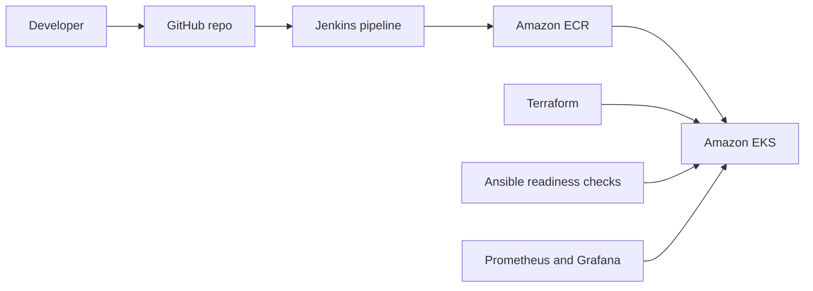

# Kubernetes Delivery Platform on AWS

An end-to-end project that takes a small Python API from code to a running, monitored release on Kubernetes (Amazon EKS). Git pushes trigger a Jenkins pipeline that tests, builds, and deploys the app with Helm. Terraform builds the AWS infrastructure, Ansible checks the cluster is ready before delivery, Gateway API splits traffic between two versions, and Prometheus and Grafana monitor it.

I built this to put hands-on, end-to-end practice behind the tools I learned on my own (Terraform, Jenkins, Helm, Ansible, AWS), alongside my professional Kubernetes operations experience.

> **Status:** in progress. 

## Architecture

## Tech stack

| Area | Tools |
|---|---|
| Application | Python, Flask, pytest |
| Containers | Docker, Amazon ECR |
| Orchestration | Kubernetes (kind locally, Amazon EKS on AWS), Helm |
| Infrastructure as code | Terraform |
| CI/CD | Jenkins |
| Traffic management | Gateway API (80/20 canary) |
| Readiness checks | Ansible |
| Monitoring | Prometheus, Grafana |
